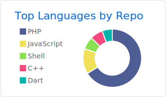

<div align="center">
  
  
  
  
  [](https://holopin.io/@sugengsulistiyawan)
</div>

## 🚀 About Me

<p align="center">
  
</p>

```typescript
const sugengSulistiyawan = {
  name: "Sugeng Sulistiyawan",
  title: "Software Engineer & Full Stack Developer",
  location: "Trenggalek, East Java, Indonesia 🇮🇩",
  experience: "5+ years",
  email: "sugeng.sulistiyawan@gmail.com",
  website: "sugengsulistiyawan.my.id",
  
  expertise: {
    webApplications: "150+ projects delivered",
    iotProjects: "50+ IoT solutions",
    logoDesigns: "200+ designs created",
    experienceYears: 5,
    teamLeadership: true,
    devOpsExperience: true
  },
  
  primaryStack: {
    backend: ["PHP", "Yii2", "Laravel", "Node.js"],
    frontend: ["Vue.js", "React", "Angular", "JavaScript", "TypeScript"],
    mobile: ["Flutter", "React Native", "Android Studio"],
    databases: ["MySQL", "PostgreSQL", "Redis", "MongoDB"],
    cloud: ["AWS (EC2, S3, RDS)", "Google Cloud"],
    devOps: ["Docker", "Kubernetes", "CI/CD", "Ubuntu Server"],
    iot: ["Arduino", "ESP32", "ESP8266", "C++"],
    design: ["CorelDraw", "Adobe Illustrator", "Figma"],
    networking: ["Mikrotik", "DNS", "Network Architecture"]
  },
  
  currentRole: "Full-stack Developer, DevOps & Network Operator",
  currentCompany: "RSUD dr. Soedomo Trenggalek",
  
  passions: [
    "Solving Complex Problems",
    "Leading & Inspiring Teams",
    "Open Source Collaboration",
    "Innovating in IoT & Automation"
  ],
  
  hobbies: [
    "Exploring New Tech & Reading",
    "Writing & Sharing Knowledge",
    "Building IoT Prototypes",
    "Designing Scalable Architectures",
    "Creative Coding",
    "Enjoying Specialty Coffee ☕"
  ],
  
  philosophy: "Friendly engineer who believes in continuous learning",
};
```

## 🛠️ Tech Stack

<div align="center">

### Frontend


### Backend & Server


### Mobile Development


### IoT & Hardware


### Database & Cloud


### DevOps & Infrastructure


### Design & Creative


### Tools & Others


</div>

## 📊 GitHub Statistics

<div align="center">
  
  
</div>

<div align="center">
  
</div>

### 📈 Contribution Graph

<div align="center">
  
</div>

### 🏆 GitHub Trophies

<div align="center">
  
</div>

## 📱 Connect with me

<div align="center">
  
[](https://linkedin.com/in/sugeng-sulistiyawan)
[](mailto:sugeng.sulistiyawan@gmail.com)
[](https://sugengsulistiyawan.my.id)
[](https://github.com/sugeng-sulistiyawan)
[](https://gitlab.com/sugeng-sulistiyawan)
[](https://youtube.com/@sugeng-sulistiyawan)
[](https://instagram.com/sugeng-sulistiyawan)
[](https://facebook.com/sugeng-sulistiyawan)

</div>

## 🎯 Current Focus & Role

- 🏥 **Current Position:** Full-stack Developer, DevOps & Network Operator at **RSUD dr. Soedomo Trenggalek**
- 🔭 Currently working on **Healthcare Web Applications & Infrastructure**
- 🌱 Learning **Advanced Cloud Architecture & Network Security**
- � **Achievements:** 150+ Web Applications | 50+ IoT Projects | 200+ Logo Designs
- 👥 **Leadership:** Team management & project coordination experience
- 💬 Ask me about **PHP/Yii2, Laravel, Vue.js, React, Node.js, IoT, DevOps**
- 📫 How to reach me: **<sugeng.sulistiyawan@gmail.com>**
- ⚡ Fun fact: **Friendly engineer who loves problem-solving and continuous learning!**

## 💼 Professional Experience Highlights

```javascript
const careerJourney = [
  {
    role: "Full-stack Developer, DevOps & Network Operator",
    company: "RSUD dr. Soedomo Trenggalek",
    period: "June 2024 - January 2025",
    technologies: ["PHP", "Yii2", "Laravel", "Angular", "Node.js", "AWS", "Ubuntu Server", "Mikrotik"],
    responsibilities: [
      "Developing healthcare web applications",
      "Server configuration & maintenance",
      "Network infrastructure management",
      "Database optimization (MySQL, PostgreSQL)"
    ]
  },
  {
    role: "Full-stack Developer & DevOps",
    company: "Matador Lectro, Surakarta", 
    period: "August 2023 - May 2024",
    technologies: ["PHP", "Yii2", "Node.js", "React Native", "Flutter", "AWS"],
    achievements: [
      "Developed web & mobile applications",
      "Published apps to Google Play Store",
      "Managed cloud infrastructure (EC2, S3, RDS)",
      "Implemented SEO optimization"
    ]
  },
  {
    role: "Project Manager",
    company: "Matador Lectro, Surakarta",
    period: "September 2022 - 2023", 
    tools: ["Notion", "Trello"],
    achievements: [
      "Led cross-functional teams",
      "Managed project budgets & requirements",
      "Delivered projects on time and within budget",
      "Stakeholder communication & reporting"
    ]
  },
  {
    role: "Firmware Engineer", 
    company: "Matador Lectro, Surakarta",
    period: "August 2021 - August 2022",
    technologies: ["Arduino", "C++", "ESP32"],
    achievements: [
      "Designed electrical system specifications",
      "Created comprehensive test plans", 
      "Optimized production processes",
      "Collaborated with engineering teams"
    ]
  },
  {
    role: "Freelance Developer & Designer",
    period: "2015 - Present",
    specialization: "Supporting UMKM (SMEs) in Indonesia",
    achievements: [
      "150+ web applications delivered",
      "200+ logo & graphic designs created",
      "Supporting local businesses digitalization",
      "Full-stack development across multiple technologies"
    ]
  }
];
```

## 🎓 Education & Certifications

**🎓 Formal Education:**

- **S1 Mathematics Education** - Universitas Sebelas Maret, Surakarta (2015-2022)
- **Science Track** - SMAN 1 Trenggalek (2012-2015)

**📚 Professional Development:**

- **VIP Course** - Laravel, Vue, React, Inertia, NextJs, Tailwind (Parsinta)
- **Flutter + Laravel** - Build Online Shop (Build With Angga)
- **Docker + Kubernetes** - Google Cloud Training
- **Vue.js Fundamental** - DANA
- **Network Configuration** - UPT TIK Universitas Sebelas Maret
- **Typography Design & Journalistic** - LPM Kentingan

## Key Achievements & Stats

<div align="center">

| 🎯 **Category** | 📊 **Achievement** | 📈 **Impact** |
|---|---|---|
| **Web Applications** | 150+ Projects Delivered | Healthcare, Business & SME Solutions |
| **IoT Projects** | 50+ Hardware Solutions | Smart Systems & Automation |
| **Logo Designs** | 200+ Creative Works | Branding for Companies & Organizations |
| **Experience** | 5+ Years | Full Stack & DevOps Expertise |
| **Leadership** | Project Management | Cross-functional Team Coordination |
| **Education** | Mathematics Degree | Problem-solving & Analytical Thinking |

</div>

## 🛡️ Core Competencies

```yaml
Technical_Skills:
  Backend_Development:
    - "PHP (Yii2, Laravel, CodeIgniter) - Expert Level"
    - "Node.js & Express.js - Advanced"
    - "API Development & Integration"
    - "Database Design & Optimization"
  
  Frontend_Development:
    - "Vue.js & React - Advanced"
    - "JavaScript/TypeScript - Expert"
    - "Responsive Design & UI/UX"
    - "Progressive Web Apps"
  
  Mobile_Development:
    - "Flutter & React Native"
    - "Android Native Development"
    - "Cross-platform Solutions"
  
  DevOps_Infrastructure:
    - "AWS (EC2, S3, RDS) - Advanced"
    - "Docker & Kubernetes"
    - "CI/CD Implementation"
    - "Server Administration (Ubuntu)"
    - "Network Configuration (Mikrotik)"
  
  IoT_Hardware:
    - "Arduino & ESP32/ESP8266 Programming"
    - "C++ for Embedded Systems"
    - "Sensor Integration & Data Collection"
    - "Hardware-Software Integration"
    - "Raspberry Pi Development"

Soft_Skills:
  - "Team Leadership & Project Management"
  - "Problem Solving & Critical Thinking"
  - "Effective Communication"
  - "Time Management & Multitasking"
  - "Adaptability & Fast Learning"
  - "Creative Design Thinking"
```

## 🌟 Professional Values

- **🤝 Collaboration:** Experienced in working with cross-functional teams and stakeholders
- **🎯 Results-Driven:** Focus on delivering high-quality solutions that meet business objectives  
- **📚 Continuous Learning:** Always exploring new technologies and best practices
- **💡 Innovation:** Bringing creative solutions to complex technical challenges
- **🔧 Problem Solving:** Strong analytical skills with attention to detail
- **🌱 Mentorship:** Passionate about sharing knowledge and supporting team growth

## 📊 Detailed GitHub Analytics

<div align="center">

[](profile-summary-card-output/github/0-profile-details.svg)
[](profile-summary-card-output/github/1-repos-per-language.svg) [](profile-summary-card-output/github/2-most-commit-language.svg)
[](profile-summary-card-output/github/3-stats.svg) [](profile-summary-card-output/github/4-productive-time.svg)

</div>

## 💰 Support My Work

<div align="center">
  
[](https://www.buymeacoffee.com/sugeng-sulistiyawan)
[](https://paypal.me/sugeng-sulistiyawan)
[](https://ko-fi.com/sugeng-sulistiyawan)

</div>

## � Hobbies & Interests

Beyond coding, I enjoy a variety of activities that help me stay balanced and innovative:

- **📚 Reading:** Staying updated with tech trends and expanding knowledge
- **✍️ Writing:** Sharing experiences and technical insights through blogs
- **🔧 IoT Prototyping:** Building smart home devices and automation systems
- **�️ Software Architecture:** Designing scalable and maintainable systems
- **💻 Open Source Contributing:** Contributing to community projects and libraries
- **🎨 UI/UX Design:** Creating intuitive and user-friendly interfaces

<div align="center">
  

  <br>

  
  [](https://github.com/sugeng-sulistiyawan?tab=followers)
  
  <h3>⭐ Show some love by starring some repositories! ⭐</h3>
</div>
