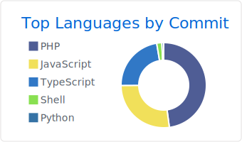

<div align="center">
  
  
  
  
  [](https://holopin.io/@sugengsulistiyawan)
</div>

## 🚀 About Me


```typescript
const my = {
  name: "Sugeng Sulistiyawan",
  location: "Indonesia 🇮🇩",
  role: "Full Stack Developer",
  languages: ["JavaScript", "TypeScript", "Python", "PHP", "Java"],
  frameworks: ["React", "Vue.js", "Node.js", "Laravel", "Yii"],
  databases: ["MySQL", "PostgreSQL", "MongoDB", "Redis"],
  tools: ["Docker", "Git", "AWS", "Firebase"],
  currentFocus: "Building scalable web applications",
  hobbies: ["Coding", "Open Source", "Learning new technologies"],
  coffee: "☕ Always brewing",
};
```

## 🛠️ Tech Stack

<div align="center">

### Frontend


### Backend


### Database & Cloud


### Tools & Others


</div>

## 📊 GitHub Statistics

<div align="center">
  
  
</div>

<div align="center">
  
</div>

### 📈 Contribution Graph
<div align="center">
  
</div>

### 🏆 GitHub Trophies
<div align="center">
  
</div>

## 📱 Connect with me

<div align="center">
  
[](https://linkedin.com/in/sugeng-sulistiyawan)
[](https://twitter.com/sugeng-sulistiyawan)
[](https://instagram.com/sugeng-sulistiyawan)
[](mailto:sugeng-sulistiyawan@gmail.com)
[](https://sugeng-sulistiyawan.me)

</div>

## 🎯 Current Focus

- 🔭 I'm currently working on **Full Stack Web Applications**
- 🌱 I'm currently learning **Cloud Architecture & DevOps**
- 👯 I'm looking to collaborate on **Open Source Projects**
- 💬 Ask me about **JavaScript, TypeScript, React, Node.js, Laravel**
- 📫 How to reach me: **sugeng-sulistiyawan@gmail.com**
- ⚡ Fun fact: **I love coffee and coding at night! ☕🌙**

## 💼 Experience Highlights

```javascript
const experience = [
  {
    role: "Full Stack Developer",
    period: "2020 - Present",
    technologies: ["React", "Node.js", "TypeScript", "AWS"],
    achievements: [
      "Built 10+ responsive web applications",
      "Improved application performance by 40%",
      "Led team of 3 developers"
    ]
  },
  {
    role: "Frontend Developer", 
    period: "2018 - 2020",
    technologies: ["Vue.js", "Laravel", "MySQL"],
    achievements: [
      "Developed user-friendly interfaces",
      "Collaborated with design team",
      "Maintained legacy codebases"
    ]
  }
];
```

## 🎨 Featured Projects

<div align="center">
  
[](https://github.com/sugeng-sulistiyawan/your-awesome-project)
[](https://github.com/sugeng-sulistiyawan/another-cool-project)

</div>

## 📊 Detailed GitHub Analytics

<div align="center">

[](profile-summary-card-output/github/0-profile-details.svg)
[](profile-summary-card-output/github/1-repos-per-language.svg) [](profile-summary-card-output/github/2-most-commit-language.svg)
[](profile-summary-card-output/github/3-stats.svg) [](profile-summary-card-output/github/4-productive-time.svg)

</div>

## 💰 Support My Work

<div align="center">
  
[](https://www.buymeacoffee.com/sugeng-sulistiyawan)
[](https://paypal.me/sugeng-sulistiyawan)
[](https://ko-fi.com/sugeng-sulistiyawan)

</div>

## 📝 Latest Blog Posts

<!-- BLOG-POST-LIST:START -->
- [How to Build Scalable Web Applications](https://your-blog.com/scalable-web-apps)
- [JavaScript Best Practices in 2024](https://your-blog.com/js-best-practices)
- [Getting Started with TypeScript](https://your-blog.com/typescript-guide)
<!-- BLOG-POST-LIST:END -->

<div align="center">
  
  
  ### 🐍 Watch my contribution graph get eaten by the snake!
  
  
  
  <br>
  
  
  [](https://github.com/sugeng-sulistiyawan?tab=followers)
  
  <h3>⭐ Show some love by starring some repositories! ⭐</h3>
</div>
